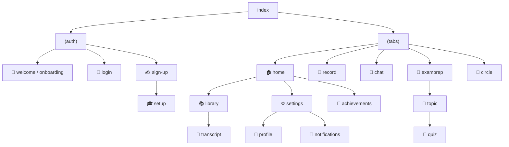

<div align="center">

# 📱 Cleveft

**Everything I was taught this semester — organised, connected, and explainable on demand.**

The Cleveft mobile app. Record a lecture, get AI-structured notes, ask questions
about what your lecturer actually said, and find out what you still need to
revise.

<br/>


</div>

---

## 🧭 Screen map

Routing is file-based via `expo-router`, split into two groups so authenticated
and unauthenticated states cannot bleed into each other.



### Before sign-in

| Route | Purpose |
| :--- | :--- |
| `(auth)/welcome` · `onboarding` | First run — what Cleveft is, and why it wants a microphone |
| `(auth)/login` · `sign-up` · `forgot-password` | Authentication and email verification |
| `(auth)/setup` | Institution, programme and courses. **After sign-up only** — signing in goes straight to home, and everything it asks is skippable and editable later from the profile |

### Tabs

| Route | Purpose |
| :--- | :--- |
| `(tabs)/home` | Dashboard — recent lectures, streak, weak areas, readiness |
| `(tabs)/record` | Live recorder with waveform, plus PDF and YouTube import |
| `(tabs)/chat` | RAG chat over your own lectures, with transcript citations |
| `(tabs)/examprep` | Quizzes, topic readiness and performance tracking |
| `(tabs)/collab` | Your circle — board, feed, shared paths and coursemates |

### Pushed on top

| Route | Purpose |
| :--- | :--- |
| `library` | Every lecture you own, searchable and filterable by course |
| `transcript` | Transcript reader, structured notes and key concepts |
| `topic` · `quiz` | One topic's questions, and the quiz player |
| `achievements` | Streaks, milestones and what is still unearned |
| `profile` · `settings` | Identity and courses; theme, password, deletion |
| `notifications` | Per-category push toggles, daily reminder and quiet hours |
| `upgrade` | Plan tiers |

---

## 📥 Getting material in

Three ways in, all of which land as a `Lecture` in `PENDING` and are polled to
completion the same way — so the rest of the app never branches on where
something came from.

| Source | Endpoint | Notes |
| :--- | :--- | :--- |
| 🎤 Live recording | `POST /api/v1/transcriptions` | Multipart audio, with duration |
| 📄 PDF import | `POST /api/v1/transcriptions/documents` | Multipart; no duration, a document has no length |
| ▶️ YouTube link | `POST /api/v1/transcriptions/videos` | JSON — there is no file, only a URL |

---

## 📁 Project layout

```
app/            routes only — each file is a screen
src/api/        typed gateway client, token storage, audio and document upload
src/components/ shared UI primitives (cards, meters, headers, sheets, tab bar)
src/theme/      light and dark palettes, spacing and typography tokens
src/hooks/      data-fetching and async helpers
src/state/      auth, notifications, chrome and feedback contexts
src/lib/        pure helpers (streak, achievements, courses, notifications)
```

Both colour schemes are defined in `src/theme/palettes.ts` with **identical
keys**, so no component ever branches on which scheme is active.

---

## 🚀 Getting started

```bash
npm install
cp .env.example .env
npx expo start
```

### 🔌 Pointing the app at your backend

`EXPO_PUBLIC_GATEWAY_URL` decides which gateway the app calls. Everything goes
through port `8080` — the app never talks to a microservice directly.

| Running on | Value |
| :--- | :--- |
| Web / simulator | `http://localhost:8080` |
| Android emulator | `http://10.0.2.2:8080` |
| Physical device | `http://<your-computer-LAN-IP>:8080` |

> [!WARNING]
> A physical device **cannot reach `localhost`** — that resolves to the phone
> itself. Use the LAN address your computer reports on the same Wi-Fi network.

The backend must be running for anything past the welcome screen to work. See
[`cleveft-infra`](https://github.com/Cleveft-Project/cleveft-infra) for bringing
up the stack.

### 📲 Expo Go version

> [!IMPORTANT]
> Expo Go supports one SDK generation at a time, and this project targets
> **SDK 56**. A newer Expo Go from the app store will refuse to open it with
> *"Project is incompatible with this version of Expo Go"*. Install the matching
> build from <https://expo.dev/go?sdkVersion=56>.

---

## 📦 Building an APK

Expo Go is enough for day-to-day work, but push notifications need a real
build — remote push was removed from Expo Go on Android in SDK 53, so the app
detects Expo Go and disables them rather than crashing.

```bash
npx eas build --platform android --profile preview
```

The `preview` profile in `eas.json` produces an installable APK rather than an
app bundle. Set `EXPO_PUBLIC_GATEWAY_URL` in that profile's `env` to the gateway
the build should talk to; a build has no `.env` to read.

> [!NOTE]
> Both platforms block plain HTTP by default, and the gateway serves plain HTTP.
> Android is handled by the `expo-build-properties` plugin in `app.json`; iOS by
> the `NSAppTransportSecurity` exception beside it. Put the gateway behind TLS
> and both can go — and both **must** go before any App Store submission, where
> a blanket arbitrary-loads exception needs a justification Apple will accept.

> [!WARNING]
> Bump `version` in `app.json` before rebuilding. Android refuses to install an
> APK over one with the same version code, so testers have to uninstall first.

---

## ✅ Checks

```bash
npx tsc --noEmit     # type check
npx expo lint        # lint
```

---

<div align="center">
<sub>Part of the <a href="https://github.com/Cleveft-Project">Cleveft</a> platform</sub>
</div>
