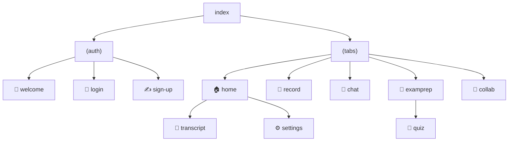

<div align="center">

# 📱 Cleveft

**Everything I was taught this semester — organised, connected, and explainable on demand.**

The Cleveft mobile app. Record a lecture, get AI-structured notes, ask questions
about what your lecturer actually said, and find out what you still need to
revise.

<br/>


</div>

---

## 🧭 Screen map

Routing is file-based via `expo-router`, split into two groups so authenticated
and unauthenticated states cannot bleed into each other.



| Route | Purpose |
| :--- | :--- |
| `(auth)/welcome` · `login` · `sign-up` | Onboarding and authentication |
| `(tabs)/home` | Dashboard — recent lectures, streak, weak areas, readiness |
| `(tabs)/record` | Audio recorder with live waveform, plus PDF import |
| `(tabs)/chat` | RAG chat over your own lectures, with transcript citations |
| `(tabs)/examprep` | Quizzes and performance tracking |
| `(tabs)/collab` | Peers, shared learning paths and threads |
| `transcript` | Transcript reader and note view for one lecture |
| `quiz` | Quiz player |
| `settings` · `upgrade` | Profile, theme, sign out, plan tiers |

---

## 📁 Project layout

```
app/            routes only — each file is a screen
src/api/        typed gateway client, token storage, audio upload
src/components/ shared UI primitives (cards, meters, headers, tab bar)
src/theme/      light and dark palettes, spacing and typography tokens
src/hooks/      data-fetching and async helpers
src/state/      auth context
src/lib/        pure helpers (streak computation, formatting)
```

Both colour schemes are defined in `src/theme/palettes.ts` with **identical
keys**, so no component ever branches on which scheme is active.

---

## 🚀 Getting started

```bash
npm install
cp .env.example .env
npx expo start
```

### 🔌 Pointing the app at your backend

`EXPO_PUBLIC_GATEWAY_URL` decides which gateway the app calls. Everything goes
through port `8080` — the app never talks to a microservice directly.

| Running on | Value |
| :--- | :--- |
| Web / simulator | `http://localhost:8080` |
| Android emulator | `http://10.0.2.2:8080` |
| Physical device | `http://<your-computer-LAN-IP>:8080` |

> [!WARNING]
> A physical device **cannot reach `localhost`** — that resolves to the phone
> itself. Use the LAN address your computer reports on the same Wi-Fi network.

The backend must be running for anything past the welcome screen to work. See
[`cleveft-infra`](https://github.com/Cleveft-Project/cleveft-infra) for bringing
up the stack.

### 📲 Expo Go version

> [!IMPORTANT]
> Expo Go supports one SDK generation at a time, and this project targets
> **SDK 56**. A newer Expo Go from the app store will refuse to open it with
> *"Project is incompatible with this version of Expo Go"*. Install the matching
> build from <https://expo.dev/go?sdkVersion=56>.

---

## ✅ Checks

```bash
npx tsc --noEmit     # type check
npx expo lint        # lint
```

---

<div align="center">
<sub>Part of the <a href="https://github.com/Cleveft-Project">Cleveft</a> platform</sub>
</div>
